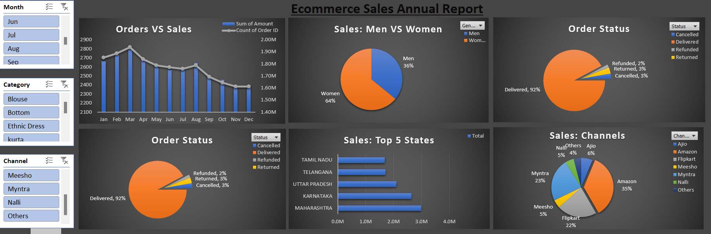

# E-commerce Sales Dashboard Project

This project involves the complete lifecycle of data processing, from data collection to creating an interactive dashboard in Excel for an E-commerce store's sales analysis. The dashboard visualizes various insights such as order status, sales by channel, and sales across different states, which help in understanding the sales trends and performance.

## Project Overview

1. **Data Collection** 
    - The data was collected from various sources related to the E-commerce store's sales.
    
2. **Data Cleaning**
    - The raw data was cleaned to remove any inconsistencies, errors, and missing values to ensure the accuracy of the analysis.
    
3. **Data Transformation**
    - The cleaned data was transformed into a more usable format. This step involved normalizing, aggregating, and creating new derived variables that could help in the analysis.
    
4. **Data Preprocessing**
    - The data was further preprocessed, including steps like encoding categorical variables, scaling numerical data, and splitting data where necessary.
    
5. **Data Analysis**
    - Exploratory Data Analysis (EDA) was performed to uncover trends, patterns, and relationships in the data. Various statistical techniques and visualizations were employed to derive meaningful insights.
    
6. **Dashboard Creation**
    - The final insights were visualized using an interactive dashboard in Microsoft Excel, making it easy to analyze and present the findings.

## Preview

Check out a preview of the dashboard:



This image shows the main sections of the dashboard, including Orders vs Sales, Sales by Gender, Order Status, Top 5 States, and Sales by Channels.

## Files in the Repository

- `Ecommerce Store Data(After Analysis).xlsx`: The final Excel file containing the cleaned, transformed, and analyzed data, along with the interactive dashboard.
- `image.png`: A screenshot of the final dashboard for quick reference.

## How to Use

1. Clone the repository to your local machine.
    ```bash
    git clone <repository-url>
    ```
2. Open the `Ecommerce Store Data(After Analysis).xlsx` file in Microsoft Excel.
3. Interact with the dashboard using slicers and filters to explore different aspects of the data.

## References

- The data used in this project was fictional or sourced from publicly available datasets.
- Microsoft Excel was used for the creation of the dashboard.
